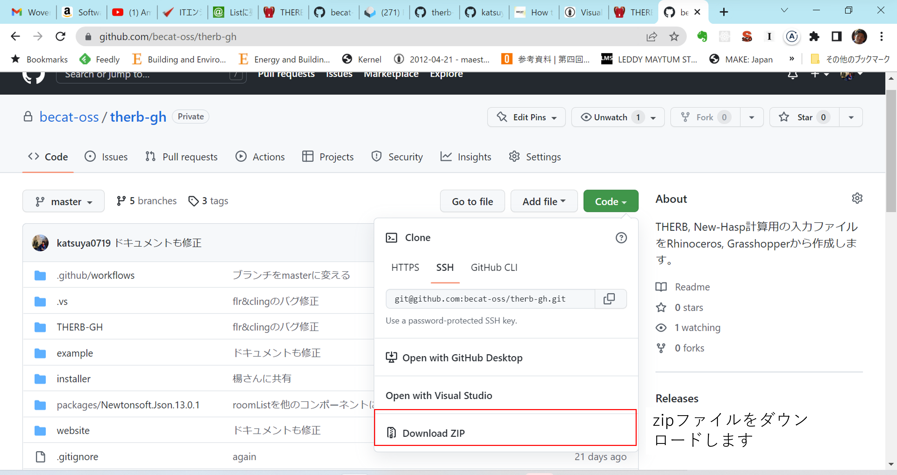

### Githubの説明  

#### githubとは？  
プログラム開発を複数人で効率よく進めるのに適したwebサービスです。  
詳細はググるといろいろ出てくるので、見てみてください。  
例えば[こんなページとか](https://www.fujitsu.com/jp/products/software/resources/feature-stories/cloud/github-overview/)  

#### githubを使用する利点  
ポイントとして、githubを使う利点は以下があげられます。  
1. コードのバージョン管理ができる => コミット  
2. 複数人で同時並行で開発を進められる => ブランチ、プッシュ、プル  
3. コードを使うためのドキュメンテーションを付与できる => README.md  
4. 世界中のエンジニアたちが開発しているプログラムをオープンソース（誰でも利用、活用できるプログラム）で公開しているので、自分の目的にあうプログラムを見つけて使用することができます。  例)Ladybug&Honeybee, Radiance, EnergyPlus etc  

#### githubの使い方  
皆がプログラムを編集するわけではないと思うので、以下に目的別の使用方法をまとめました。自分の目的に応じて、自分のPC環境を設定してみてください。 
0. 共通の手続き  
githubにあるプログラムを使うだけの人も、プログラムを編集する人もまずはgithubにアカウント登録する必要があります。  
0-1. githubにアカウント登録する  

0-2. [becat-oss](https://github.com/becat-oss)をフォローする  

0-3. [therb-gh](https://github.com/becat-oss/therb-gh)プロジェクトにスターをつける  

(0-4. RhinoがPCに入っている人は、therb-ghをドキュメントに沿って自分のPCにインストールしてみてください)  

1. プログラムを使うだけ（編集はしない）  
一番初心者の人の用途です。  
オープンソースのプロジェクトを見つけて利用します。  
[THERB-GH](https://github.com/becat-oss/therb-gh)を例にして、説明します。  

  
図のようにボタンを押して、zipファイルとしてダウンロードできます。    
下の画面にファイルの使い方が説明されています。  

2. プログラムを編集する  
プログラムを編集する用途の場合は、1のようにダウンロードするだけでなく、PCで編集した内容をgithubにアップロードできるようにする必要があります。  
この操作はコマンドラインで行うこともできるのですが、慣れていないとなかなか難しいのでsourcetreeというGUIソフトウェアをインストールして使うことをおすすめします。  
[インストールページ](https://www.sourcetreeapp.com/)  

sourcetreeのインストール、環境設定方法は[こちらのページ](https://tracpath.com/bootcamp/learning_git_sourcetree.html)とかが参照できると思います。  

