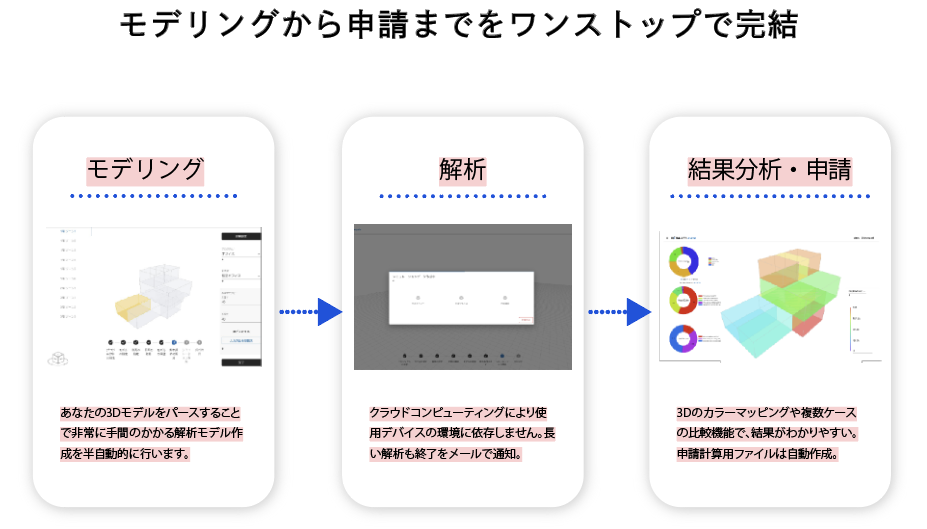
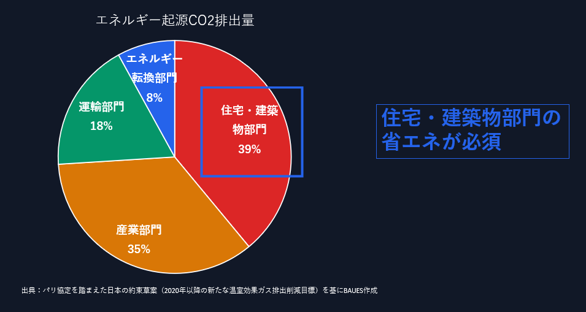

### デザインエンジニアリング特論第11回 BAUES Analysis, Pandas, Matplotlib  

pandasは9回目の授業で気象データ(epw)を扱うために使用したライブラリです。  
流れが早すぎてよくわからなかったという反応が多かったので、もう一度pandasについて使い方を教えます。  
pandasで使用するデータとして、建物のエネルギーシミュレーションができるwebアプリBAUES Analysisを使用するので、BAUES Analysisの説明も冒頭に入れます。  

BAUES Analysisとは？  
設計における決定が建物のエネルギー性能にどう影響するのかをより手軽に確認できる  
  

なぜエネルギー？  
40%のエネルギー消費量消費量が建物起因  
  

環境に関わる全ての設計判断（パッシブデザイン、アクティブデザイン含め）はエネルギー消費量という形で定量化される。  

[BAUES Analysis](https://analysis.baues.io/docs/basic-flow)のドキュメンテーションに沿って実際にエネルギーシミュレーションをしてみましょう。  

計算結果が出たところで、ダウンロードページからcsvをダウンロードし、以下のフォルダに移動します。  
```
design-engineering-class/class11_pandas2/data
```  

分析するデータの準備ができたので、前回同様Jupyter notebookを立ち上げてpandas, matplotlibを触っていきます  
(既に9回目の授業で皆のPCにはAnacondaがインストールされていると思うので、Anacondaのインストールステップはとばします。）  
1-1. Anaconda Powershell Promptを開く  
1-2. class11_pandas2のフォルダに移動  
```
cd design-engineering-class/class11_pandas2
```  
1-3. 以下のコマンドを叩いて、jupyter notebookを起動  
```
jupyter notebook  
```   

最終課題  
自分なりのテーマを持って、環境データに関して分析をしてみてください。  
そのときに以下のツールのうちどれかを使用してください。（複数組み合わせて使うのももちろんありです）  
- climateStudio  
- Ladybug&Honeybee  
- BAUES Analysis  
- pandas  
- matplotlib/seaborn    
次の授業までに自分なりのテーマを持って1分くらいで発表してください。

参照  
[Pandas](https://pandas.pydata.org/)\
Excelでデータを扱うように、データ処理を行えるライブラリです  

[Matplotlib](https://matplotlib.org/)\
様々なデータの可視化を行えるライブラリです  

