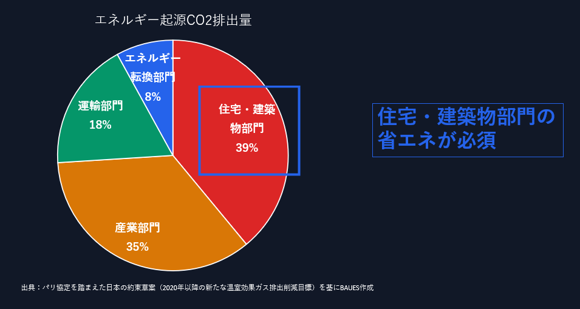
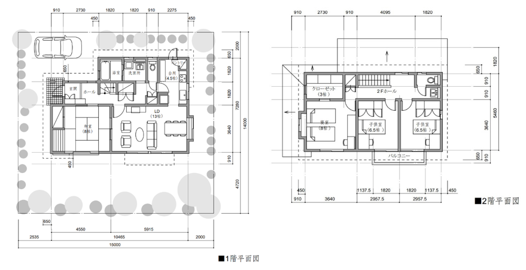
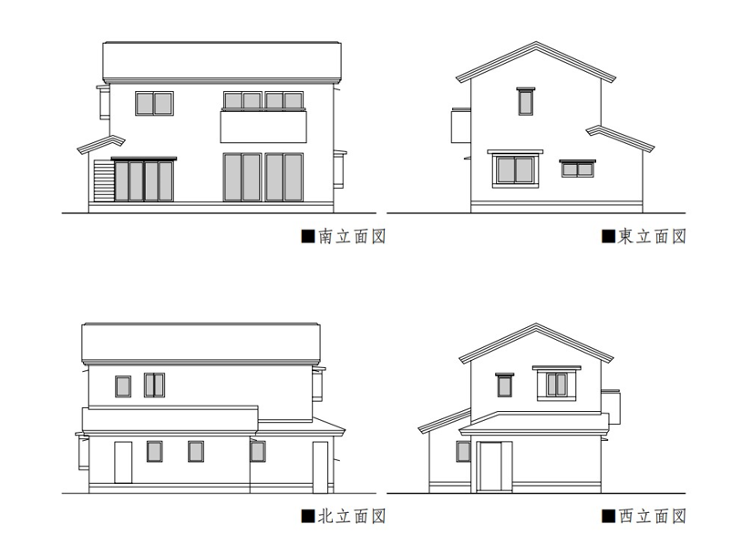

### デザインエンジニアリング特論第10回 BAUES Analysis

#### BAUES Analysisとは?

建築設計における環境シミュレーション、結果に基づく設計アドバイスを行うwebアプリです。\
[説明](https://analysis.baues.io/en/docs/introduction)

#### なぜエネルギーについて考える必要があるのか?

\
日本から排出しているCO2のうち、40%は住宅・建築物部門から\
=>2050年のカーボンニュートラル達成のために、設計者へのプレッシャーは更に大きくなる

#### 実際に触ってみよう

##### 今回はRhinceros上でモデリング->Grasshopperを用いてBAUES Analysisにアップロードという流れでやってみます

##### デモで使用するのはIBECという組織が出しているモデルです

以下の図面情報を既に準備してあるRhinoモデルを[github](https://github.com/katsuya0719/design-engineering-class/tree/main/class12_BAUES_analysis/example)からダウンロードできます

[BAUES Analysisのドキュメンテーション]()を用いて説明を行います。

#### 計算結果を見てみよう

##### 建物全体のエネルギー消費量

赤枠で囲んでいる部分が建物全体の年間エネルギー消費量です。他の計算結果と比較しやすくするために、建物の延べ床面積で割った値、空調面積で割った値を示しています。（EUI
Energy Use Intensityと呼びます） 日本の基準では、EUIを基準としている例は見られませんが、シンガポールで使われているGreen
MarkというGreen Certificateで、建物の省エネ性能を相対化するための基準として使われていたりします。

BAUES
Analysisでは、建物内で消費するエネルギーを以下の項目について計算しています。それぞれのエネルギー消費量がどういったパラメータによって決まってくるかを説明します。

- 暖房
- 冷房
- 照明
- OA機器
- 搬送動力（ファン） 給湯も住宅における主要なエネルギー消費項目ですが、まだ計算機能を実装できていません。今後実装予定です。
