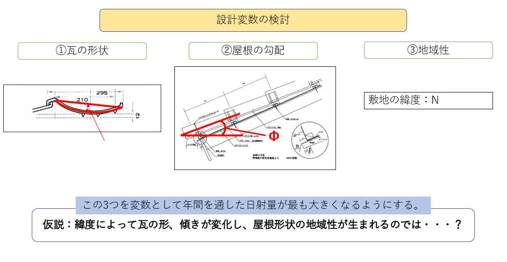

### デザインエンジニアリング特論第15回   

#### 三橋先生のアドバイスを受けといたほうがいい最終レポート  
#### 稲葉君  

#### 山崎君  

#### 煙突効果の検証  
そもそも煙突効果の物理現象に関わる計算式ってどうなってる？  
[サイト](https://kougakukeisan.com/2021/09/21/%E7%85%99%E7%AA%81%E5%8A%B9%E6%9E%9C/)  

仲嶋君の想定と根拠を聞く  

#### 日射解析を用いた太陽光パネルの形状最適化  
   
瓦の形状は、どういうパラメータで規定しようと考えているか？ => arc?  
地域性という変数で、緯度を抽出しているのはあえて？ => 敷地の緯度が変わるということは、地域も変わり、他の変数の影響もあって、日射量自体が変わる  

#### 最終レポート提出期限  
8/8 18時まで  

#### 最終レポート評価軸  
- テーマ設定、着眼点  
- 論構成、レポート全体のわかりやすさ    
- 分析の深さ、スキル  

#### 授業の最後に  
忘れる前にこちらのフォームを記入してもらいながら、あとの話は聞いてください  
[大学全体の授業評価フォーム](https://forms.office.com/pages/responsepage.aspx?id=iV9x12qT90q7daV6yZZG-otWq_pFMxRMtYOk53xHMNNUMUJYUlM3U0c1SFBURzJYS0Y5TUJLN0pORy4u)  
[授業改善のために意見をください](https://docs.google.com/forms/d/e/1FAIpQLSecElQ99c5h0HCWnzKvhaMSH-Z_hiWfLvKM-ZN2kcJWYNIQuQ/viewform?usp=sf_link)

最後、これから就職活動する皆に話しておきたいこと  
- ARUPのデジタルチームにいたときに、チームリーダーが言っていたARUPの次なる競争相手    
- ARUP Hong Kongで働いていたとき、中国、東南アジア出身でアメリカ、イギリスの有名大学を卒業した英語ペラペラでやる気もある同僚が多くいた  
- 日本人だけが勤勉なんじゃない、アジアの知識階級皆勤勉  
- 日本は内需だけで大企業が成り立ってきた。これからは違う  
- 僕のいたBuilding Sustainabilityチームは当時できて10年くらいの若いチームで、平均年齢も若かった  
- 企業の平均年齢って意外とその会社の雰囲気、カルチャーを表す  
- 企業を見るときに大事なのは絶対量よりも差分+将来へのプロジェクション  

- 元同僚がGEのデータサイエンティストになって事務処理作業の自動化をしたら、その事務作業をしていた人がクビになったという話  
- 某ゼネコンの社内BIMシステム  

- Woven City / Sidewalk - 都市計画の主体がMobility, IoTなどを切り口とした建設、不動産業界以外のケースが意味するもの  
- Woven Cityに投資されている額 > ARUPの〇〇  => 会社で面白いプロジェクトに関わりたかったら、会社が何に投資をしようとしているかを把握しておく必要  
- 建設業界で最も成功しているスタートアップは？  

僕が就活生のときにやっておけばよかったと思ってること    
- 業界地図を買って、とりあえず世の中にはどんな業界があるのか眺めてみる  
- 就活をしている企業の業績見通しを見てみる => その企業の業績はどうなっていくのか？ => 株式会社である以上、いい業績を残さないといけない義務があるので、業績が悪い場合には面白くないけどお金になるプロジェクトをやらないといけない  

メッセージ  
- 学び続ける、変わることをいとわない  
建設業界だけじゃなく、全ての業界は変革期。そして、この変化の波はITによってもたされているので、スピードは止まることはない。  
大学で習ったことだって、陳腐化する知識も少なくない。  
他の業界で発明された技術が建設業界にもたらせることだってある。  
[戦略コンサルのマッキンゼー](https://www.mckinsey.com/business-functions/operations/our-insights/the-next-normal-in-construction-how-disruption-is-reshaping-the-worlds-largest-ecosystem)は建設業界に製造業の工場型プレファブリケーションがもたらされると言っている。
=> この中でゼネコンの今までのビジネスモデルは成り立たなくなっていくと言っている  
=> ほんとにゼネコン行くの？　少なくとも終身雇用は期待しないほうがいい。ゼネコンという資本力のある企業で自分がどんなスキル、能力を獲得し、自分の力でキャリアを描いていくのかを考えて  

そのためには「自分は建築を勉強したから」建設業界って自分を規定するのではなく、もっと根源的なスキルとして「問題を発見する能力」「チームをまとめて一つにする能力」「ロジカルに考える力」「わかりやすくプレゼンする力」、もちろん「デザイン力」「プログラミングスキル」「数字処理能力」など、自分は何が得意か、興味があるかを考え、深掘る不断の努力を

