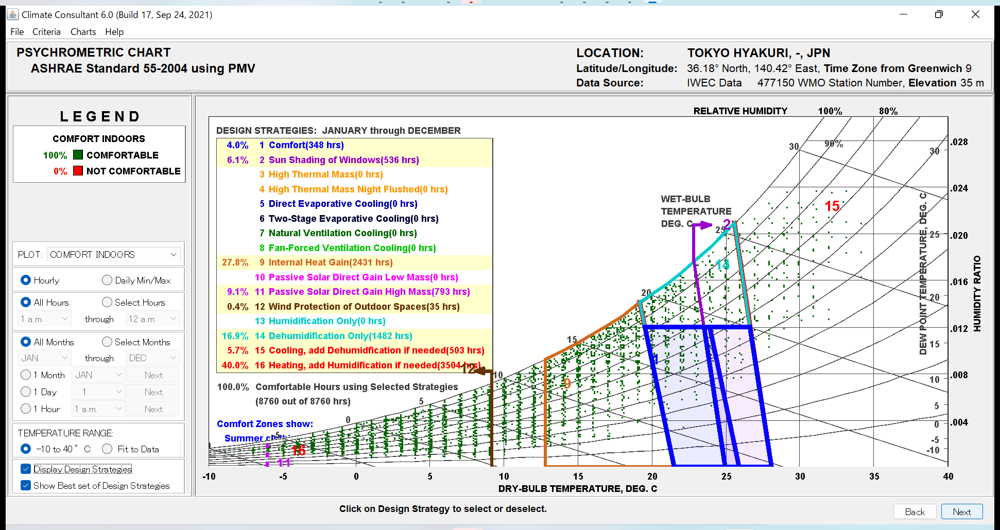
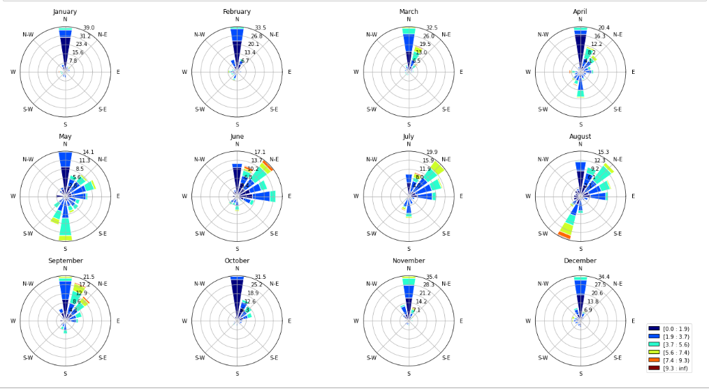
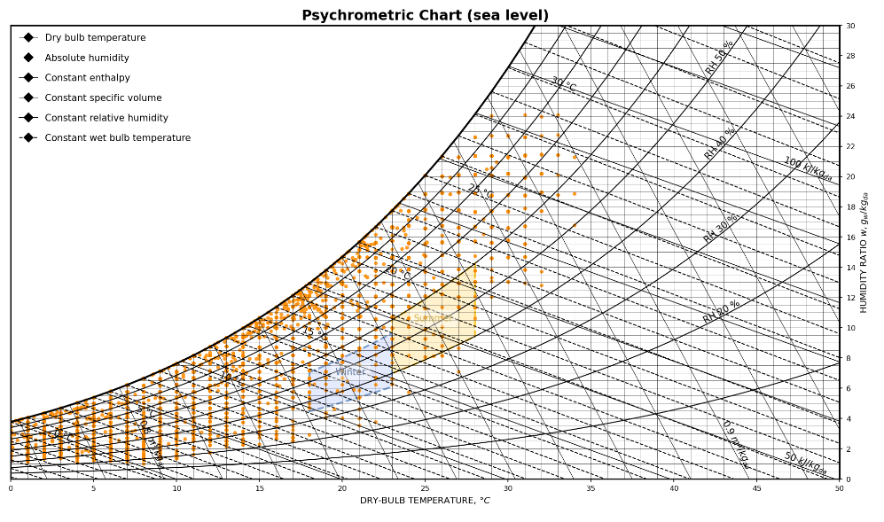

### デザインエンジニアリング特論第9回 ClimateConsultant Pandas

#### climate consultantとは?

気象データを可視化するツールです。Ladybug&HoneybeeやclimateStudioで使われている湿り空気線図上の快適線プロットやヒートマップなどのビジュアルの元祖はここじゃないかと勝手に思っています。\
[webサイト](https://www.sbse.org/resources/climate-consultant)からOSにあわせてインストーラをダウンロードしてください  

湿り空気線図上に全気象データをプロットするだけでなく、passive designの効果を定量的に分析することができます。  
  

#### jupyter notebookを用いて、Python、pandasを使ってみる
epwデータの分析を以下のような可視化をしながら分析します  




1. Pythonの環境を設定する\
   1-1. Anacondaをインストールする\
   Anacondaとはデータ分析、機械学習などに必要なライブラリをパッケージしたソフトウェアです。\
   [webサイト](https://www.anaconda.com/products/distribution)からパッケージをインストールします。

インストールの手順は[こちらのwebサイト](https://www.python.jp/install/anaconda/windows/install.html)を参照します。

1-2. Anaconda Promptを開く\
アプリケーションからAnaconda promptを開きます

1-3.Anaconda Prompt内で以下のフォルダに移動　　
```
cd design-engineering-class/class9_pandas
```

1-4. Anaconda Prompt以下のコマンドで今回のデモ用の環境を構築する
```
conda env create -f=pandas_env.yml
```

1-5. 以下のコマンドで2-3で作成した環境に入る

```
activate class9_pandas
```

2. jupyter notebookを以下のコマンドで起動

```
jupyter notebook
```


---

今回の授業では以下のライブラリ、データを使用します。\
Pythonライブラリ\
[Pandas](https://pandas.pydata.org/)\
Excelでデータを扱うように、データ処理を行えるライブラリです

[Matplotlib](https://matplotlib.org/)\
様々なデータの可視化を行えるライブラリです

[Windrose](https://hatarilabs.com/ih-en/how-to-make-a-wind-rose-with-python-tutorial)\
Wind roseを表示できるライブラリです  

[psychrochart](https://github.com/azogue/psychrochart)  
psychrochartは湿り空気線図を扱えるpythonライブラリです。 
[kinotofuさんの記事](https://zenn.dev/kinonotofu/articles/210f2835d9a6e3)が日本語ソースで詳しく説明されていました。オリジナルの文献よりも細かく説明されているのでおすすめです。  

データセット\
[epwデータ](https://building-env.com/epw)\
以下、building-envサイトより\
epwは、EnergyPlus Weather Dataの略であり、エネルギー消費量のシミュレーションに広く使用されているEnergyPlus用の気象データ

---  
環境編の課題  
自分なりのテーマをもって、気象データについてpandas、matplotlib,seabornなどを使いながら分析、可視化しなさい。
提出物はjupyter notebookとする。  
